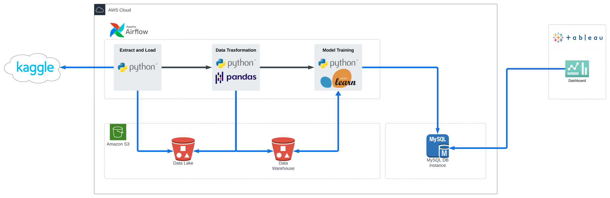
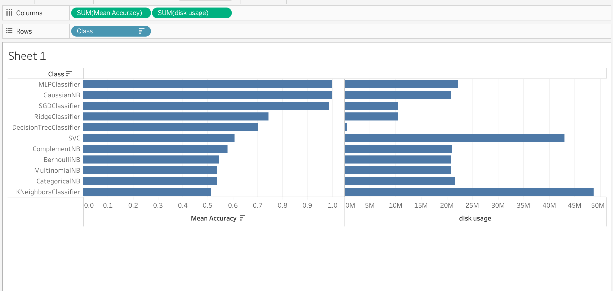

<!-- # should describe (no more that 3-4 lines for the following topics) -->

<!--  **Title**: What is the title of your project? -->
# ML Model Performance Comparison for Glassdoor Job Title Prediction Text Classifier
---
## Team members
- Eugene Jung Jo 
- Chang Kyu Kim

<!--  **Project’s function**: This is an overall description of your project: What is objective of the project? What is the problem you are trying to solve? -->

# Description
---

## Objective

In this project, we wanted to create a robust data pipeline that takes the raw web-scraped job posting data from Glassdoor, build several text classification models that can predict the job title based on the job description, and finally compare the model mean scores and accuracy. We chose this project as we are interested in Natural Language Processing and working with the real world unclean data to develop a good classification model is a useful pattern that can be applied in many other use cases.

<!--  **Dataset**: Briefly describe your dataset -->

## Dataset

We are using the [Data Science Job Posting on Glassdoor](https://www.kaggle.com/datasets/rashikrahmanpritom/data-science-job-posting-on-glassdoor) dataset that is available from Kaggle. The author scrapped the data science related job postings from Glassdoor's website about three years ago. The author provides a raw and cleaned version of the data, and we are using the raw version. This dataset provides several features such as salary range, company name, size, industry and many others, but we are mainly using the job title as the label data and the raw job description as the feature data to build the classifiers.

<!--  **Pipeline / Architecture**: Which pipeline did you use? Which tools? -->

## Pipeline and Architecture

We chose the batch data ingestion and ML model training pipeline for this project. Since we are not dealing with a streaming data source, a batch data ingestion was suitable for our project. The pipeline downloads the raw data from Kaggle, cleaning and preprocessing the job title and job description field, and training 11 different ML models and recording the classifier performance. 

We used Airflow to orchestrate the end-to-end data pipeline from data ingestion to training the ML model. For feature engineering, we used Pandas library to convert the raw data into a dataframe and apply the data cleaning and transformation. Finally, for the models training, we used scikit-learn library to experiment different classification models and generated the trained model as a python pickle files.

<!-- **Data Quality Assessment**: Describe the quality status of the data set and the way you assessed it -->
## Data Quality Assessment

Instead of using the author's cleaned data, We have taken the raw data and converted it into a Pandas DataFrame for EDA. We have looked for the data anomaly such as duplicate, missing data, and inspected the job title and job description data. We did not need to explore the other numerical features such as salary or the categorical data like industry and company name as our project is focused on job title and description. 

We believe this data is trustworthy as we can validate the entries by looking up the company names to make sure it is an actual company and comparing with the web archive of the job posting data if it is available. The data is also likely authentic, and we can validate by comparing the data with the web archive version.

<!-- **Data Transformation Models used**: Briefly describe the transformations and models used and final results that you were able to achieve. If there are any special instructions needed to execute your code (e.g., signing up to a specific API to access the dataset that is needed) those need to be listed as well. -->

## Data Transformation and Models Used

For data preprocessing and transformation, we mainly focused on the NLP text normalization over the job title and job description. We mainly used the following techniques:

- Case Normalization
- Punctuation Removal
- Stop Words Removal
- Lemmatization
- Grouping the job titles to specific categories

We have trained a total of 11 text classification ML models using the same dataset and compared the model performance. Assuming that these models would be served by some sort of web service, we also compared the trained model's pickled data size.

As for reproducing the pipeline and the final output, we have created a separate  file detailing the steps.

<!--  **Infographic**: A simple infographic describing the architecture of your data pipeline including datasets, storage, and tools used along with another final infographic describing the results of the engineering task accomplished. Examples can be provided if needed. -->

### Architecture

### Final Result

**Code**: https://github.com/iameugenejo/ece5984project/tree/main/final

**Thorough Investigation**:  <!-- This critically assesses the viability of your idea: Based on the results of this project (your pilot project, your prototype, etc), from a technical leadership point of view, what are your conclusions or recommendations for continuing this project in terms of scaling it up? How would you assess the innovativeness of your project? Any technical or platform concerns, difficulties, or limitations of the pipeline for the project? Based on your experience and results, what next step would you recommend to take this project to the next level/phase? -->

The idea of the project is to build a system that continuously improves the classification models by periodically feeding the data to them as long as the models support partial-fitting. 

The next phase of the project would be to ensure that the data fed to the model that resulted in lower accuracy are discarded.

The limitation of the system is that this system does not support unlearning outdated data.

A possible way to unlearn the outdated data in chronological order can be to store `N` number of trained models where `N` is the number of training iterations to keep, then keep generating a fresh new model every iteration and partial fitting the `N-1` previous models.

