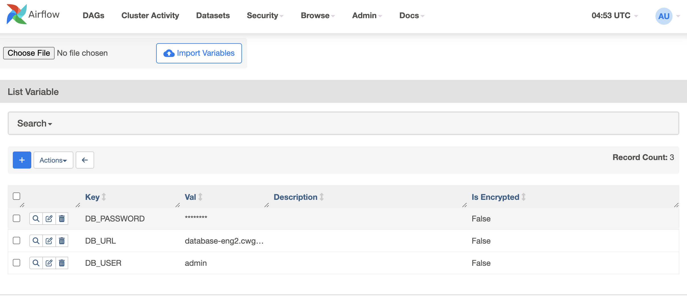
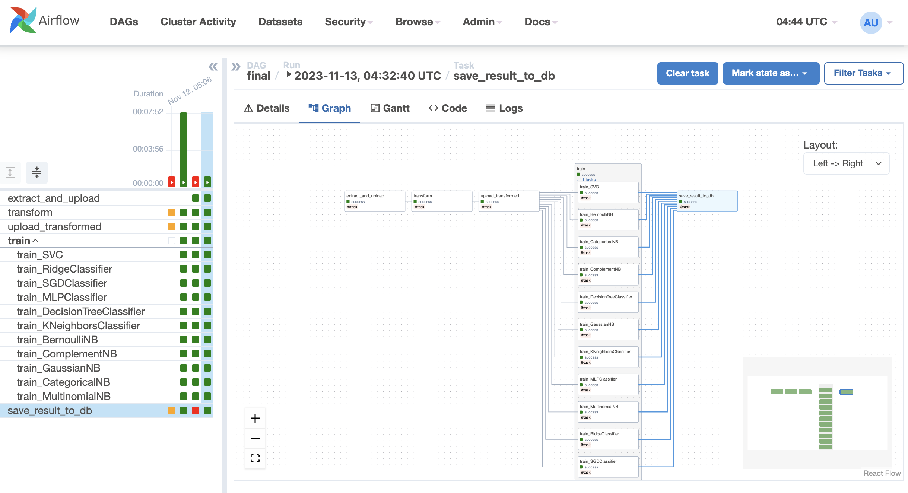

# ECE5984 Final Project
by Chang Kyu Kim and Eugene Jung Jo

## Setup

* Clone and symlink the project final folder in the airflow directory then launch the Airflow server
```shell
# run the VM with -p 53306-54306:3306
# e.g.) docker run --rm -it --entrypoint bash -v /home/ubuntu/efs-mount-point/students/eugenejj/root:/root -p 8080-8131:8080 -p 9092-9143:9092 -p 53306-54306:3306 --name eugenejj pipeline:latest

apt-get update && apt-get install -y git mysql-server

nano /etc/mysql/mysql.conf.d/mysqld.cnf
# update bind-address = 127.0.0.1 to bind-address = 0.0.0.0

service mysql start

mysql

# mysql> CREATE USER 'user'@'%' IDENTIFIED BY '{{ INSERT PASSWORD }}';
# mysql> GRANT ALL PRIVILEGES ON *.* TO 'user'@'%' WITH GRANT OPTION;
# mysql> FLUSH PRIVILEGES;
# mysql> exit

cd /tmp

git clone https://github.com/iameugenejo/ece5984project.git

cd ~/airflow

# backup dags
mv dags dags_backup

# symlink the project folder
ln -sf /tmp/ece5894project/final dags

# install requirements
pip install -r dags/requirements.txt

airflow standalone
```

* Setup Airflow Variables
  * Required:
    * `DB_PASSWORD`: database password
  * Optional:
    * `DB_URL`: database url
    * `DB_USER`: database user
    * `DB_DB`: database name 
    * `SOURCE_PATH`: raw data source path (must be a public HTTP link to a zip file)
    * `DL_PATH`: data lake path (must be an accessible s3 path)
    * `DW_PATH`: data warehouse path (must be an accessible s3 path)
    * `TITLE_COLUMN`: title column name
    * `DESCRIPTION_COLUMN`: description column name



## Airflow tasks


## Tableau

